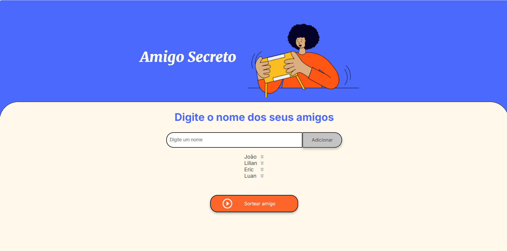

# Desafio Amigo Secreto

## Sobre o repositório
🔹 Repositório criado para armazenar projeto construído durante o Challenge ONE Lógica de Programação - Amigo secreto;  
🔹 Desafio realizado no curso #ONE (Oracle Next Education), uma  parceria da Oracle com Alura;  
🔹 **Link do desafio:** [Clique aqui](https://cursos.alura.com.br/course/logica-programacao-challenge-amigo-secreto).  

## Sobre o projeto
🔹 Este projeto é uma implementação do jogo "Amigo Secreto", onde participantes trocam presentes de forma aleatória. 
🔹 O objetivo é praticar lógica de programação e aplicar conceitos de gestão de projetos utilizando a ferramenta Trello.

## Funcionalidades
- Cadastro de participantes;
- Opção para remover nomes;
- Formatação automática dos nomes:
    - Toda vez que um nome for digitado, a primeira letra de cada palavra será convertida para maiúscula.
    - Exemplo:
        - joão → João;
        - pedro luiZ → Pedro Luiz.
    Isso garante um padrão visual mais organizado para os nomes dos participantes.
- Validação de entrada:
    - Apenas nomes que contenham letras (acentuadas ou não), apóstrofos ('), espaços e hífens (-) serão aceitos.
    - Qualquer caractere inválido impedirá o cadastro do nome.
- Sorteio aleatório de amigos secretos;
- Exibição dos resultados do sorteio.

##  Ferramentas utilizadas:

 

 

## Deploy
🔹 **Deploy GitHub Pages:** [Clique aqui]()  
🔹 **Deploy Vercel:** [Clique aqui]()

## Resultado/Demonstração

  

